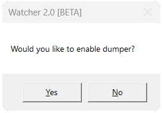
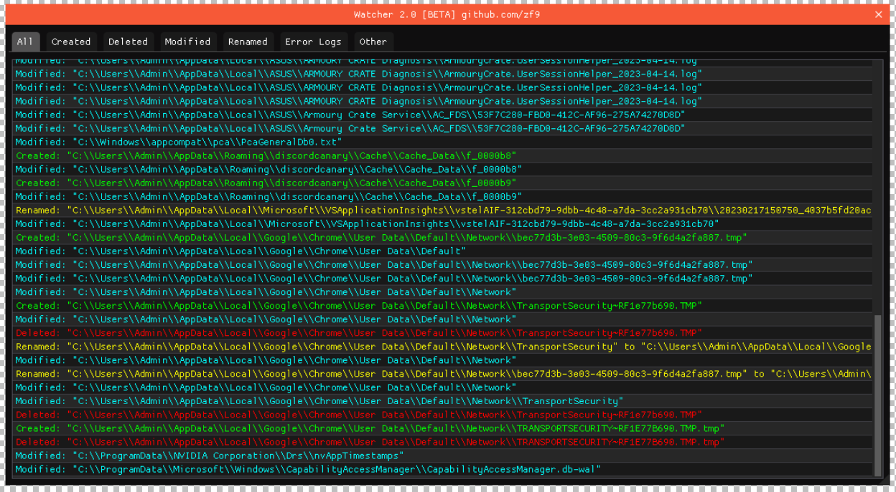
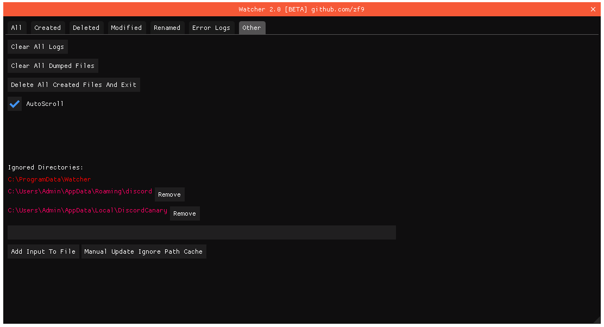

# Welcome to my GitHub Repository!

### Connect with me on Discord
If you have any questions or just want to chat, you can reach me on Discord at `ZF9#7655`.

### ImGui Base
This project uses [ImGui-Standalone](https://github.com/adamhlt/ImGui-Standalone) as its base. ImGui is a bloat-free graphical user interface library for C++.

### Hammafia UI
This project uses a theme made by [HammafiaUI](https://github.com/iswahyudi440/HammafiaUI) inspired by the original Hammafia FiveM Lua Executor.

### Powered by OpenAI
This project makes use of OpenAI's advanced language model [ChatGPT](https://chat.openai.com). ChatGPT is capable of generating human-like text responses, making it a powerful tool for a variety of applications.

## Project Description
This project is a File System Watcher that detects changes in files and directories in real-time. It can detect when files are created, modified, renamed, or deleted, and provide notifications of these changes. Additionally, it has the option to dump the changed files to a specified folder, making it a useful tool for backups and file management. The File System Watcher is highly configurable and can be tailored to meet your specific needs. Whether you're a developer looking to automate your workflow or a system administrator in need of reliable file management, this project has you covered.

## Getting Started

### Prerequisites
- Visual Studio (if compiling from source)

### Downloading the Release
1. Go to the Releases section of this repository.
2. Download the latest release as a zip file.
3. Extract the contents of the zip file to a directory of your choice.

### Compiling from Source
1. Clone this repository to your local machine.
2. Open the solution file in Visual Studio.
3. Build the solution in Visual Studio (press `Ctrl` + `Shift` + `B` or select "Build Solution" from the Build menu).
4. The compiled executable can be found in the `bin` directory of the project.

## Running the File System Watcher
1. Double-click on the executable to run the File System Watcher.
2. Follow the on-screen instructions to configure the File System Watcher to your needs.
3. The File System Watcher will begin detecting changes in your file system and providing notifications as needed.

## License
This project is licensed under the MIT License.

Permission is hereby granted, free of charge, to any person obtaining a copy of this software and associated documentation files (the "Software"), to deal in the Software without restriction, including without limitation the rights to use, copy, modify, merge, publish, distribute, sublicense, and/or sell copies of the Software, and to permit persons to whom the Software is furnished to do so, subject to the following conditions:

The above copyright notice and this permission notice shall be included in all copies or substantial portions of the Software.

THE SOFTWARE IS PROVIDED "AS IS", WITHOUT WARRANTY OF ANY KIND, EXPRESS OR IMPLIED, INCLUDING BUT NOT LIMITED TO THE WARRANTIES OF MERCHANTABILITY, FITNESS FOR A PARTICULAR PURPOSE AND NONINFRINGEMENT. IN NO EVENT SHALL THE AUTHORS OR COPYRIGHT HOLDERS BE LIABLE FOR ANY CLAIM, DAMAGES OR OTHER LIABILITY, WHETHER IN AN ACTION OF CONTRACT, TORT OR OTHERWISE, ARISING FROM, OUT OF OR IN CONNECTION WITH THE SOFTWARE OR THE USE OR OTHER DEALINGS IN THE SOFTWARE.

Please note that it is not allowed to claim this software as your own or to modify and distribute it without proper attribution.

